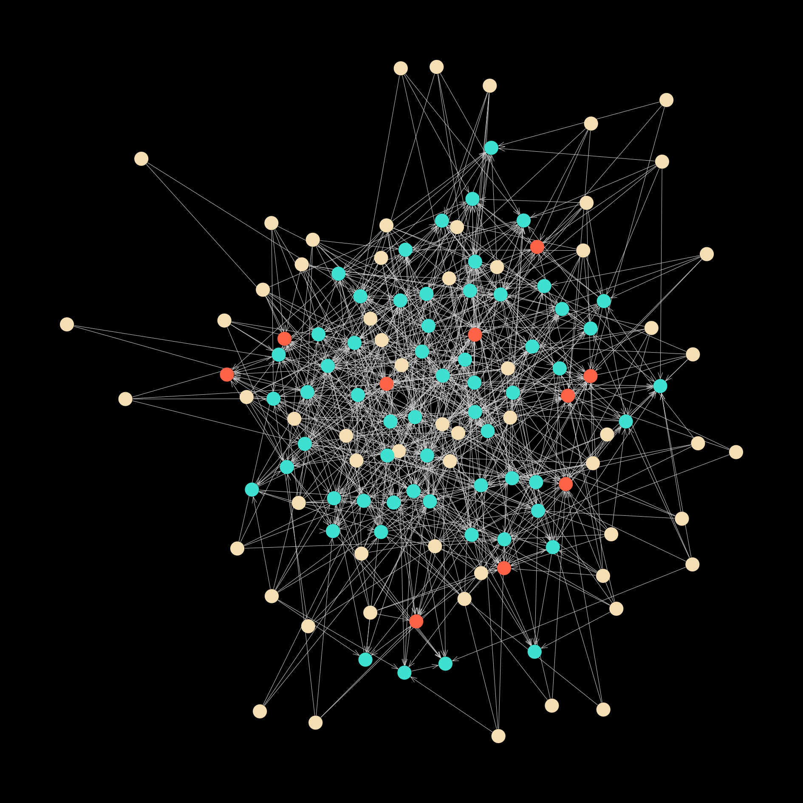
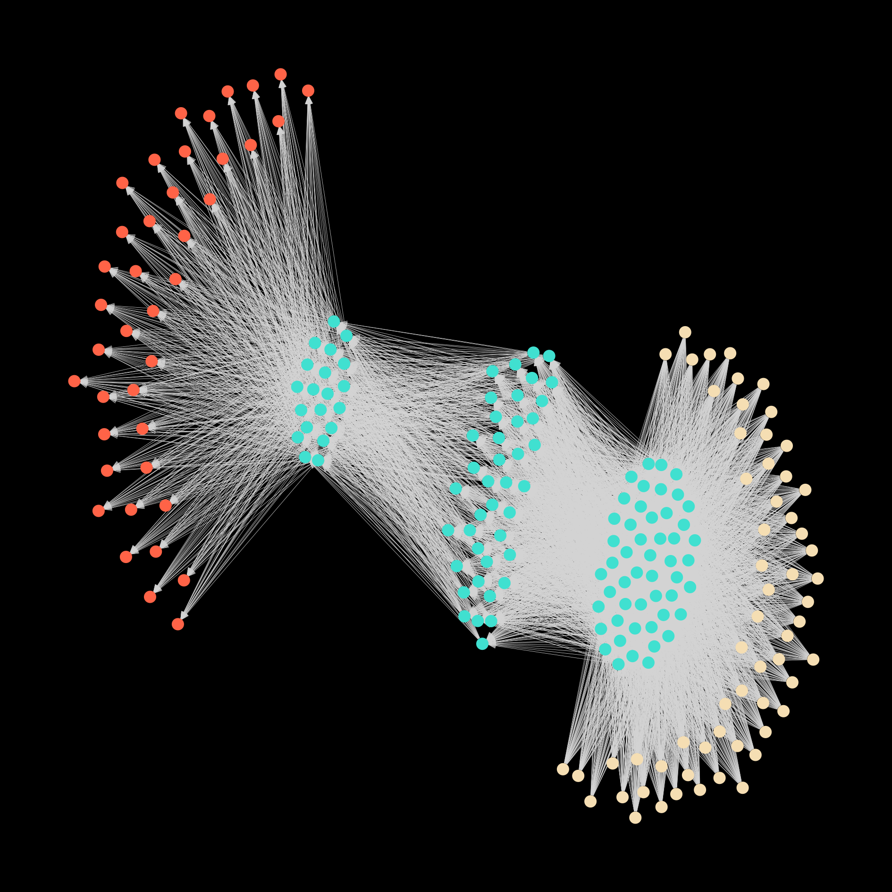

# Neural-Networks-with-Arbitrary-Structures
I thought it would be interesting to play around with Neural Networks, but consider them as graphs which can have almost completely arbitrary structures. In doing so we can try out all sorts of different structres, allowing skip connections - in fact not dealing with any notion of 'layers' at all. There is still functionality for multilayer perceptron networks though.

Currently a requirement of the networks is that they are directed acyclic graphs instead of cyclic graphs - i.e. we can't have any feedback loops. Apart from this, the connections between different neurons can essentially be randomized, and for a bit of fun we can plot these sorts of graphs in NN_tests.jl:

Input neurons, where our data is fed into the network are coloured yellow. Our middle hidden neurons are blue, and the output neurons are red. Of course, for now geometric positions of neurons in these plots mean nothing. 
While a completely random structure is rather messy, plotting the structure of a network with layers is a bit more intuitive and understandable.

All these networks can trained with stochastic gradient descent and backpropogation, and some functionality for testing networks (on data such as the MNIST digits) is included in NN_tests.jl.

This is just a work in progress, but there are a load of things with network structure that could be fun to investigate and play around with in the future. 
One could generalize this further to allow feedback loops in the network, giving some weird RNNs? 
One could allocate some sort of location information to each neuron and only allow weights connecting neurons that are local / near by.
One could change the network structure with training (i.e. neural architecture search).
